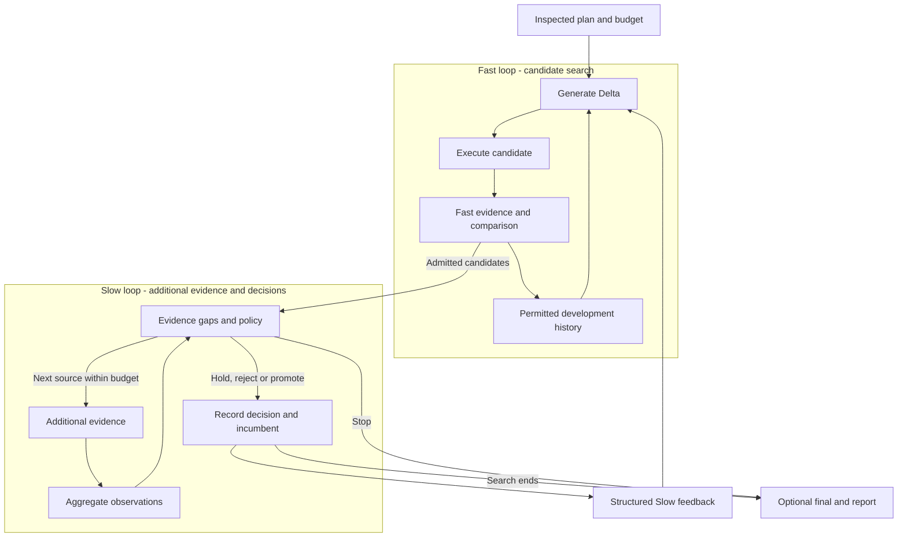

# DUO

**Let your Agent try changes. Compare test results and costs before you decide.**

**English** · [简体中文](./README.zh-CN.md)

[Install](./dsh-plugin/README.md) · [Agent Guide](./dsh-plugin/AGENT_GUIDE.md) · [Documentation](./docs/README.md) · [Origins](./docs/THIRD_PARTY_NOTICES.md)

[](https://github.com/CZ-ZL/duo/actions/workflows/product.yml)

Changing an Agent means more than editing a prompt: you need to run tests, compare versions and keep track of what each attempt cost. **DUO puts that work into one repeatable workflow inside DeepSeek Harness (DSH).**

Choose a prompt or supported component setting, define how to judge it, and set a budget. DUO measures the original, generates alternative versions and tests them. You get the proposed changes, evaluation results and cost records to decide what to keep. If the evidence does not justify a replacement, DUO can recommend keeping the original. Applying a change remains your decision.

## Why choose DUO?

DUO is built for teams already using DSH who want an Agent to run improvement experiments through public tools, with an inspectable plan and a record of every decision.

| Feature | What it gives you |
|---|---|
| **An Agent-operated DSH workflow** | Discover capabilities, prepare inputs, inspect a plan, run and retrieve a report through public tools. Reuse DSH's model, tool and permission services. |
| **Search and additional validation have separate jobs** | Fast screens changes with available tests. Slow follows the frozen plan to acquire more evidence, such as additional tasks or boundary checks, for admitted candidates; permitted feedback informs later search. Basic optimization can run without extra evidence and reports that limitation. |
| **Your tests and replaceable components** | Bring an executable evaluator; replace the Target adapter, Generator or selection policy through supported interfaces. This lets you change what is tested and how candidates are chosen without editing DUO Core. |
| **A budget and a record for each attempt** | Inspect candidate changes, results, failures, selection reasons and inner-operation cost receipts. Unknown costs stop paid work. The Calling Agent's own costs need a separate host budget. |
| **History you can reuse with clear boundaries** | Warm start screens compatible development history. Final evidence stays out of search; recovery preserves the original allowance at supported settled checkpoints. |

You can start with evaluation only. If the goal or tests are unclear, the calling Agent can use DUO's preparation tools to identify what is missing before a run. Supported changes depend on the connected adapter; [current support](./dsh-plugin/CURRENT_STATUS.md) lists prompt support, the limited configuration target and custom-adapter requirements.

## Use from your Agent

For example, ask your Agent:

> “Check where this Agent fails my existing tests. Then try changes within a ¥2 budget and show me the results and costs. Leave the original unchanged.”

Install the [versioned plugin package](./dsh-plugin/README.md) into your DSH profile, then start with `dualloop_describe`. Your Agent uses the public tools to check suitability, prepare the tests and providers, inspect the plan, run within your authorization and retrieve the report. Model access and executable evaluators must be connected; the [Agent Guide](./dsh-plugin/AGENT_GUIDE.md) explains the setup.

Use the release tarball linked above: the installable bundle lives in `dsh-plugin/`, while the repository root contains development tools. Community catalog submission status is tracked [here](./docs/product-foundation/DISTRIBUTION.md).

## How does DUO fit alongside other tools?

These tools overlap. The table compares documented workflows and intended use, not benchmark performance; official sources were checked on September 16, 2026.

| Tool | Documented focus | When to consider it |
|---|---|---|
| [Promptfoo](https://www.promptfoo.dev/docs/intro/) | Evaluation and red teaming, configurable assertions, comparison views and CI integration. | You mainly need to test and compare LLM application behavior. |
| [DSPy](https://dspy.ai/diving-deeper/choosing-an-optimizer/) | Build LM programs and optimize their instructions, examples or, with a suitable optimizer, model weights against a metric. | You develop in DSPy and want to optimize a program within that framework. |
| [GEPA / optimize_anything](https://gepa-ai.github.io/gepa/api/optimize_anything/optimize_anything/) | Search over scorable text artifacts with evaluator feedback, configurable engines and budgets. It also provides an [Agent skill](https://gepa-ai.github.io/gepa/guides/agent-skill/). | You want an optimizer for prompts, code or other text-represented candidates. |
| **DUO** | A DSH-native experiment lifecycle combining candidate search, optional additional evidence, replaceable policies and budget receipts. | You already use DSH and want an Agent to prepare, run and explain bounded experiments on supported components. |

DUO's emphasis is that combination inside DSH. Agent access, extensibility and budget controls are shared capabilities, not exclusive claims. Current support is a developer preview: prompts are supported, the built-in config adapter is limited, and other targets need adapters. A general quality or cost advantage has not been established.

## Try a local example

Requires Linux, Node 24+ and an existing DSH installation. The native runtime needs neither Python nor a model account.

From the source checkout, set your installed DSH package path and choose an unused example directory:

```sh
export DUO_DSH_PACKAGE=/absolute/path/to/node_modules/@deepseek-ai/dsh
node dsh-plugin/bin/duo.mjs init --root /tmp/duo-demo --dsh-package "$DUO_DSH_PACKAGE" --example evaluate
node dsh-plugin/bin/duo.mjs call --root /tmp/duo-demo --tool dualloop_describe
node dsh-plugin/bin/duo.mjs call --root /tmp/duo-demo --tool dualloop_plan --args '{"view":"summary"}'
```

This creates an isolated example and shows its plan. Follow the [quickstart](./docs/QUICKSTART.md) to inspect the plan, run it and retrieve the report. The example measures local text formatting through real DSH tools at **CNY 0** inner cost. It demonstrates the product workflow, not LLM task quality.

For an existing profile, see [package installation](./dsh-plugin/README.md). Tested host versions and platform boundaries are recorded in [current capabilities](./dsh-plugin/CURRENT_STATUS.md) and the [release index](./docs/releases/README.md).

## Choose a mode

| Your need | Preset | Behavior |
|---|---|---|
| Measure the original first | `evaluate` | Evaluation only |
| Optimize with an available measurement | `optimize-basic` | Single-fidelity search and selection |
| Use Fast plus available additional evidence | `optimize-dual` | Dual-loop search, validation and feedback |
| Negotiate from connected capabilities | `optimize-auto` | Explicit mode and downgrade reporting in plan and result |

[Runnable examples](./dsh-plugin/examples/product/README.md) cover custom Targets, BYO Evaluators, component replacement and warm start. An arbitrary file is not automatically a supported Target: it needs a compatible adapter and measurement.

## How the two loops work



Fast iterates on development evidence. Slow identifies evidence gaps, acquires planned additional measurements and produces feedback for later search. One Controller schedules both loops; two resident Agents are not required. Final evidence never feeds back into search.

Slow does not mean a more expensive model. Broader coverage is labeled `expanded_evidence`; `high_fidelity` requires a stated basis relevant to the objective. Without additional evidence, basic optimization still runs and reports single fidelity. See the [architecture](./docs/ARCHITECTURE.md) and [evidence strategy](./dsh-plugin/EVIDENCE_STRATEGY.md).

## Integrate and extend

Target, Generator, Executor, Evaluator, comparison and promotion policies, feedback and history strategies compose through existing service interfaces. DSH/Cordis supplies models, tools, permissions and lifecycle. Public contracts and type declarations are documented in the [Provider guide](./dsh-plugin/PROVIDERS.md).

Providers are trusted in-process code. Recovery covers supported settled checkpoints. Review [capability boundaries](./dsh-plugin/CURRENT_STATUS.md) and [security guidance](./dsh-plugin/SECURITY.md) before use.

## Development, evidence and origins

- Development: [contributing](./CONTRIBUTING.md), [tests](./docs/development/TESTING.md), [repository layout](./docs/development/REPOSITORY_LAYOUT.md).
- Versions and acceptance: [release index](./docs/releases/README.md), [changelog](./docs/releases/CHANGELOG.md).
- Research: [historical results](./docs/research/EXPERIMENTS.md). Method research is paused. A general quality or total-cost advantage over a reasonable single loop has not been established; product acceptance does not establish method efficacy.

The two-loop approach was inspired by Wang et al.'s [*Self-Evolving Recommendation System*](https://arxiv.org/abs/2602.10226). DUO is an independent adaptation to Agent components and does not inherit the paper's experimental results. It runs on [DeepSeek Harness](https://github.com/deepseek-ai/deepseek-harness) and [Cordis](https://github.com/cordiverse/cordis). Code is [MIT licensed](./LICENSE); see [origins and third-party notices](./docs/THIRD_PARTY_NOTICES.md) for attribution.
