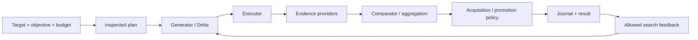

# DUO — evaluation and optimization inside DSH

[English](README.md) · [简体中文](README.zh-CN.md)

[](https://github.com/CZ-ZL/duo/actions/workflows/product.yml)

DUO is a DeepSeek Harness plugin for improving an existing Agent component under an explicit objective and budget. A Calling Agent can discover capabilities, supply a Target and Evaluator, inspect a plan, run it, and retrieve candidates, evidence, decisions and costs through public tools.

**Retaining the original is a valid result.** DUO does not automatically deploy candidates. Its product checks establish runtime behavior; a general quality or total-cost advantage over a reasonable single loop has not been established.

The **0.6.0 product line** adds explicit Slow evidence modes, repairs selection and cumulative budget boundaries, and ships typed extension contracts. See [current capabilities](CURRENT_STATUS.md), [acceptance and remaining work](docs/slow-evidence-strategy/QUEUE.md), and [release notes](RELEASE_NOTES_v0.6.0.md). The earlier [0.5.0 acceptance](PRODUCT_ACCEPTANCE.json) remains unchanged.

## When to use it

Use DUO when you have an existing component that can be changed safely, an observable objective, and an executable measurement. Start with evaluation when the task or measurement is still being prepared.

| You have | Public preset | What runs |
|---|---|---|
| A Target and Evaluator | `evaluate` | Measure the original; no candidate generation |
| An objective, Evaluator and budget | `optimize-basic` | Generate, evaluate and select using one evidence source |
| Fast evidence and an applicable additional source | `optimize-dual` | Acquire additional evidence before terminal selection |
| Optional additional evidence | `optimize-auto` | Negotiate the available mode and disclose any fallback |

Slow is an **evidence acquisition and decision strategy**, not a more expensive model score. It can request a planned measurement, hold, reject, promote or stop. Additional evidence is labeled `expanded_evidence` or `high_fidelity` according to its declared coverage and qualification. With no information increment, Slow is `unavailable`; basic optimization remains usable. Read [the evidence contract](dsh-plugin/EVIDENCE_STRATEGY.md) for the exact boundaries.

## Run a free local example

Requires **Linux, Node 24+ and an existing DSH installation**. The verified host target is DSH `0.1.2-rc.1`, Cordis `4.0.2`, Node `24.14.1` and pnpm `11.24.0`. Native execution needs no Python or model account.

From this checkout, choose a new directory and point to your installed DSH package:

```sh
export DUO_DSH_PACKAGE=/absolute/path/to/node_modules/@deepseek-ai/dsh
node dsh-plugin/bin/duo.mjs init --root /tmp/duo-demo --dsh-package "$DUO_DSH_PACKAGE" --example optimize
node dsh-plugin/bin/duo.mjs call --root /tmp/duo-demo --tool dualloop_describe
node dsh-plugin/bin/duo.mjs call --root /tmp/duo-demo --tool dualloop_plan --args '{"view":"summary"}'
```

Inspect the returned plan, then copy its exact `planDigest` and `runId`:

```sh
node dsh-plugin/bin/duo.mjs call --root /tmp/duo-demo --tool dualloop_run --args '{"planDigest":"PASTE_PLAN_DIGEST"}'
node dsh-plugin/bin/duo.mjs call --root /tmp/duo-demo --tool dualloop_report --args '{"runId":"PASTE_RUN_ID","view":"summary"}'
```

The example measures local text hygiene at **¥0**. It exercises real DSH tools with deterministic providers; it does not measure LLM Agent quality. `init` refuses an existing directory, preserves the original Target, and stages an isolated profile. Calls, responses and logs remain under the example directory.

Use `--example evaluate`, `dual`, `byo`, `replace`, `warm` or `custom` for other paths. The [example guide](dsh-plugin/examples/product/README.md) explains setup, component replacement and history reuse.

## Install in your own DSH profile

Download the reviewed `dual-loop-dsh-plugin-0.6.0.tgz` from the [private v0.6.0 release](https://github.com/CZ-ZL/duo/releases/tag/v0.6.0), or build the same package from this checkout:

```sh
cd dsh-plugin
npm pack --offline --ignore-scripts
```

Then install the resulting tarball into an authorized profile:

```sh
dsh plugin --profile YOUR_PROFILE add /absolute/path/dual-loop-dsh-plugin-0.6.0.tgz
dsh --profile YOUR_PROFILE --dump-config
```

Installation may download peer dependencies. The profile must provide an application and tools. DUO's default bundle exposes preparation and waits for work providers; it does not enable a model route or grant spending authority. Read [package setup](dsh-plugin/README.md) and the [Agent guide](AGENT_GUIDE.md). This repository does not publish the package to npm.

## Architecture and extension boundaries



The controller owns the shared lifecycle, cancellation and supported recovery. DSH/Cordis owns provider binding, model execution, tools, permissions and disposal. Changes use existing service seams:

| Component | Responsibility |
|---|---|
| Target | Snapshot, Delta validation, content identity and historical projection |
| Generator / Executor | Propose a change / execute the applied component |
| Evaluators | Produce versioned observations with cost receipts |
| Comparator / Gate | Compare scoped evidence, aggregate judgments, admit measurements and select |
| Feedback / history | Expose permitted search observations and screen warm-start records |
| Journal / Budget | Preserve decisions, accounting, allowances and settled checkpoints |

Persona overlays are supported with matching work providers. Built-in plugin configuration support is **partial**, limited to fetch `maxBodyChars`; it needs a compatible Executor/Evaluator. Custom adapters can implement the public Target contract without changing the core. [Provider contracts](dsh-plugin/PROVIDERS.md) and shipped TypeScript declarations document the supported seams.

## Boundaries that matter

- Providers are trusted in-process code. Metadata declarations are not independent attestations or OS isolation.
- Slow can request the next applicable source in the frozen schedule. It does not invent tests, install providers or calculate expected information gain.
- Recovery requires an unchanged, settled baseline/generation checkpoint and the original deadline. It does not replay unresolved calls.
- A cumulative cap accounts for unfinished run allowances. Unknown costs block capped admission. A retained admission lock requires owner/state inspection; it is not automatically stolen.
- Warm start imports screened search history, never old final scores, costs or authority. A changed evidence mode permits ideas, not score reuse.
- The inner ledger does not cover every Calling Agent request. Windows/macOS and arbitrary interrupted-call recovery are unsupported.

## Development and evidence

```sh
npm ci --ignore-scripts --no-audit --no-fund
npm run format:check
npm run typecheck  # DUO_DSH_PACKAGE must be set
bash scripts/release_gate.sh /tmp/new-duo-release-check
```

[TESTING.md](TESTING.md) separates native regression, declaration compilation, isolated package/DSH acceptance, independent Caller usage and historical research. [CONTRIBUTING.md](CONTRIBUTING.md) covers small changes and [RELEASING.md](RELEASING.md) covers delivery. See [the cleanup record](docs/slow-evidence-strategy/LEAN.md) for rationale and regression evidence.

Method research is paused. [EXPERIMENTS.md](EXPERIMENTS.md) preserves formal negative results and subsequent diagnostics. Used final datasets stay consumed; failures and fees are retained. No Graph/Bayesian, new benchmark or additional loops are part of this release.

The Python protocol remains separately versioned at `0.1.0` behind the explicit legacy path. Project code is [MIT licensed](LICENSE); host and dataset attribution is in [THIRD_PARTY_NOTICES.md](THIRD_PARTY_NOTICES.md).
