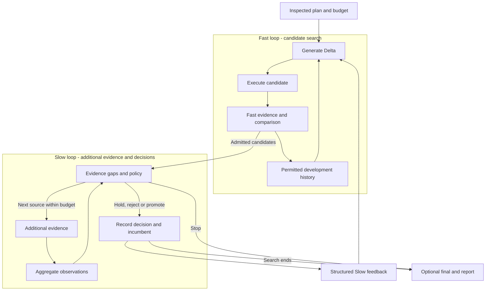

# DUO

**English** · [简体中文](./README.zh-CN.md)

[Install](./dsh-plugin/README.md) · [Agent Guide](./dsh-plugin/AGENT_GUIDE.md) · [Documentation](./docs/README.md) · [Origins](./docs/THIRD_PARTY_NOTICES.md)

[](https://github.com/CZ-ZL/duo/actions/workflows/product.yml)

DUO is a DeepSeek Harness (DSH) plugin for trying changes to an Agent's prompt or supported component settings. Give it tests and a budget. It evaluates the original, generates alternatives, runs them, and keeps the changes, results and costs for you to review.

You can start by testing the original before asking it to try anything new. If none of the changes earn their place, keeping the original is a valid outcome. You decide whether to apply a candidate.

## What it handles

Your Agent can prepare an experiment, show you the plan, run it and read the report through DUO's tools. It uses the model, tools and permissions already connected to DSH.

- Use your own tests. Evaluators, Target adapters, generators and selection policies can be replaced through the public interfaces.
- Spend extra testing effort on candidates that pass the initial screen. Fast runs the initial tests; Slow adds the further checks specified in the plan and returns feedback for later attempts. With no additional tests, you can still run basic optimization.
- Review failed attempts as well as successes. The report keeps candidate changes, scores, selection reasons and cost receipts. Unknown costs block further paid work; the calling Agent's own model costs need a separate host budget.
- Reuse compatible development history in a later run. Final-test evidence stays out of search. Recovery is supported at settled checkpoints and keeps the original allowance.

If you haven't settled on a goal or tests, the preparation tools show what is still missing. What DUO can change depends on the connected adapter. See [current support](./dsh-plugin/CURRENT_STATUS.md) for prompts, the limited configuration target and custom-adapter requirements.

## Use from your Agent

Once the plugin and work providers are set up, you can ask:

> “Run this Agent against my tests and show me where it fails. Then try a few changes, spend no more than ¥2, and show me what happened. Don't apply anything yet.”

Install the [plugin package](./dsh-plugin/README.md) into your DSH profile. Your Agent starts with `dualloop_describe` to check what is available and what needs setting up. The [Agent Guide](./dsh-plugin/AGENT_GUIDE.md) covers connecting models and evaluators, inspecting a plan, running it and reading the results.

Use the Release tarball in the installation guide. The installable package lives in `dsh-plugin/`; the repository root is for development. The [distribution notes](./docs/product-foundation/DISTRIBUTION.md) track the community catalog submission.

## Choosing a tool

There is overlap with other evaluation and optimization tools. This is a guide to their documented uses; it does not rank their performance. The linked official sources were checked on September 16, 2026.

| Tool | Documented focus | When to consider it |
|---|---|---|
| [Promptfoo](https://www.promptfoo.dev/docs/intro/) | Evaluation and red teaming, configurable assertions, comparison views and CI integration. | You mainly need to test and compare LLM application behavior. |
| [DSPy](https://dspy.ai/diving-deeper/choosing-an-optimizer/) | Build LM programs and optimize their instructions, examples or, with a suitable optimizer, model weights against a metric. | You develop in DSPy and want to optimize a program within that framework. |
| [GEPA / optimize_anything](https://gepa-ai.github.io/gepa/api/optimize_anything/optimize_anything/) | Search over scorable text artifacts with evaluator feedback, configurable engines and budgets. It also provides an [Agent skill](https://gepa-ai.github.io/gepa/guides/agent-skill/). | You want an optimizer for prompts, code or other text-represented candidates. |
| DUO | Run candidate changes inside DSH, add further tests when available, and keep the results and costs. | You use DSH and want your Agent to run these experiments through its tools. |

DSH integration is the main reason to choose DUO here. Other tools also offer Agent access, extensions and budget controls. DUO is a developer preview: it supports prompts, has a limited built-in config adapter, and needs custom adapters for other targets.

## Try a local example

Requires Linux, Node 24+ and an existing DSH installation. The native runtime needs neither Python nor a model account.

From the source checkout, set your installed DSH package path and choose an unused example directory:

```sh
export DUO_DSH_PACKAGE=/absolute/path/to/node_modules/@deepseek-ai/dsh
node dsh-plugin/bin/duo.mjs init --root /tmp/duo-demo --dsh-package "$DUO_DSH_PACKAGE" --example evaluate
node dsh-plugin/bin/duo.mjs call --root /tmp/duo-demo --tool dualloop_describe
node dsh-plugin/bin/duo.mjs call --root /tmp/duo-demo --tool dualloop_plan --args '{"view":"summary"}'
```

This creates an isolated example and shows its plan. Follow the [quickstart](./docs/QUICKSTART.md) to run it and retrieve the report. The example checks local text formatting through DSH tools, with no model calls or fees. It lets you try the workflow; it does not measure an LLM's task performance.

For an existing profile, see [package installation](./dsh-plugin/README.md). Tested host versions and platform boundaries are recorded in [current capabilities](./dsh-plugin/CURRENT_STATUS.md) and the [release index](./docs/releases/README.md).

## Choose a mode

| Your need | Preset | Behavior |
|---|---|---|
| Measure the original first | `evaluate` | Evaluation only |
| Try changes using the tests you have | `optimize-basic` | Generate, test and select candidates |
| Add further checks after Fast screening | `optimize-dual` | Search with Fast, then use Slow checks and feedback |
| Choose a mode from the connected providers | `optimize-auto` | Record the chosen mode and any downgrade in the plan and result |

[Runnable examples](./dsh-plugin/examples/product/README.md) cover custom Targets, BYO Evaluators, component replacement and warm start. An arbitrary file is not automatically a supported Target: it needs a compatible adapter and measurement.

## How the two loops work



Fast generates changes, tests them and uses the development results to guide the next attempt. Slow checks what remains untested, runs the additional measurements allowed by the plan, and sends feedback to later generations. One Controller schedules both loops. Final-test results stay out of search.

Additional tasks or boundary tests count as `expanded_evidence`. Calling evidence `high_fidelity` requires an explanation of why it better measures the objective; a higher model price is not enough. Without additional evidence, basic optimization still runs and reports that limitation. See the [architecture](./docs/ARCHITECTURE.md) and [evidence strategy](./dsh-plugin/EVIDENCE_STRATEGY.md).

## Integrate and extend

To change what DUO tests, supply a Target adapter and matching work providers. You can also replace how it generates candidates, evaluates them, selects them or uses history. The [Provider guide](./dsh-plugin/PROVIDERS.md) documents the interfaces and types. DSH/Cordis manages model access, tools, permissions and plugin lifecycle.

Providers are trusted in-process code. Recovery covers supported settled checkpoints. Review [capability boundaries](./dsh-plugin/CURRENT_STATUS.md) and [security guidance](./dsh-plugin/SECURITY.md) before use.

## Development, evidence and origins

- Development: [contributing](./CONTRIBUTING.md), [tests](./docs/development/TESTING.md), [repository layout](./docs/development/REPOSITORY_LAYOUT.md).
- Versions and acceptance: [release index](./docs/releases/README.md), [changelog](./docs/releases/CHANGELOG.md).
- Research: [experiment results](./docs/research/EXPERIMENTS.md). Research is paused. The experiments so far have not established a general quality or total-cost advantage over a reasonable single loop. Passing the product tests shows that the workflow runs as intended.

The two-loop approach was inspired by Wang et al.'s [*Self-Evolving Recommendation System*](https://arxiv.org/abs/2602.10226). DUO is an independent adaptation to Agent components and does not inherit the paper's experimental results. It runs on [DeepSeek Harness](https://github.com/deepseek-ai/deepseek-harness) and [Cordis](https://github.com/cordiverse/cordis). Code is [MIT licensed](./LICENSE); see [origins and third-party notices](./docs/THIRD_PARTY_NOTICES.md) for attribution.
