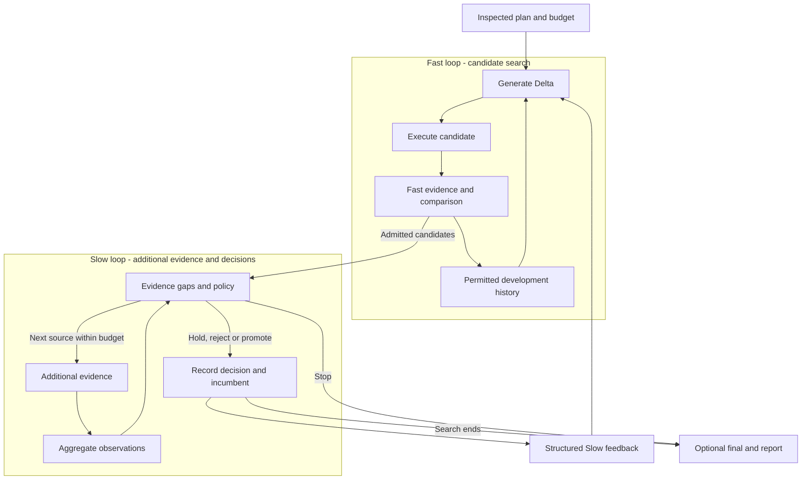

# DUO

**English** · [简体中文](./README.zh-CN.md)

[Quickstart](./dsh-plugin/QUICKSTART.md) · [Agent Guide](./dsh-plugin/AGENT_GUIDE.md) · [Documentation](./docs/README.md)

DUO is a DSH plugin that lets your Agent try changes, run your tests against the
original and each candidate, and return the results and costs for you to review.

You provide a supported Target, an evaluator, model access when needed, and a
budget. DUO handles the repeated generation, execution, comparison and recording.
It leaves the original in place. You decide whether to adopt a candidate.

## A task you can give it

Suppose your Agent answers questions from a deployment runbook. You want it to
return the documented command, cite the source, and say when the document has
no answer.

The [grounded-QA starter](./dsh-plugin/QUICKSTART.md#real-task-starter) supplies
an editable prompt, a runbook, four questions, an evaluator and the provider
configuration. You supply your DSH path, supported model configuration, work
directory and authorized budget. DUO measures the original, asks the model for
one prompt change, executes that candidate and checks the answers.

You get the candidate Delta, per-task checks, selection reason, recorded usage
and a report. No improvement is a valid outcome. This starter uses basic mode:
it has development checks, without independent Slow or final evidence.
Its live-model and unfamiliar-Caller acceptance are still pending; the
[acceptance record](./docs/product-foundation/FIRST_USE.md) tracks that boundary.

## What a recorded result looks like

This is a **historical v0.4.0 configuration experiment**, not a result from the
current starter. It used a task-specific execution binding to change how much
retrieved documentation an Agent kept.

| Report item | Observed result |
|---|---|
| Change | Fetch setting `maxBodyChars`: 100,000 → 150,000 |
| Candidate | B2 `dl-0001`, generated from the original |
| Development checks | Fast 6/6; additional Slow checks 12/12; promotion accepted |
| Why it was sent to diagnostic final | Frozen selection rule: Fast-high and already Slow-measured |
| Diagnostic final | Original 8/12; candidate 12/12 |
| Cost of the whole comparison package | 44 model requests, ¥0.18554908; includes other candidates and arms |

The single-loop candidate also scored 12/12. These are single executions on new
questions from the same public source, so this result does not establish a
general DUO advantage. No candidate was deployed. Costs use observed API usage
and frozen tariffs; Caller inference and local compute are separate.

The [redacted result and source hashes](./docs/product-foundation/first-use/HISTORICAL_RESULT.json)
come from the retained run. [Full context, failures and negative results](./docs/research/EXPERIMENTS.md)
remain available.

## Start here

Use the **[Quickstart](./dsh-plugin/QUICKSTART.md)**. Choose one path:

| Path | What it does |
|---|---|
| [Free installation check](./dsh-plugin/QUICKSTART.md#free-installation-check) | Install the package, discover capabilities, inspect a plan, run local text checks and save the report. No model requests; this checks the product flow. |
| [Real task starter](./dsh-plugin/QUICKSTART.md#real-task-starter) | Connect your authorized model and run the document-QA task above. Normally at most three inner model requests, with retries disabled. Live acceptance pending. |

Developer preview. Requires Linux, Node24+ and an existing DSH installation;
tested with DSH0.1.2-rc.1 / Cordis4.0.2. Installation does not configure your model
account or grant spending authority. DUO's ledger covers inner work, not every
request made by the Calling Agent.

## What you can use

- **Your own tests.** Supply an evaluator or wrap an existing test function.
  You choose what counts as a useful result.
- **Candidate experiments.** Generate and compare changes; add further checks
  when you have evidence beyond the initial evaluation.
- **Reusable history.** Keep failed attempts, decisions and costs. Warm start
  can pass compatible development history to a later experiment.
- **Bounded execution.** Inspect the plan before running, enforce inner budget
  limits, stop on unknown costs and recover at supported settled checkpoints.

Prompt/persona overlays are supported. The configuration adapter is limited to
one fetch setting and needs matching execution providers; it is not arbitrary
configuration optimization. Other Targets need adapters and compatible work
providers. See [current support](./dsh-plugin/CURRENT_STATUS.md) and
[security boundaries](./dsh-plugin/SECURITY.md). Providers are trusted code in the
host process; DUO does not sandbox arbitrary plugins.

## How the two loops fit

Fast generates changes, tests them and uses the development results to guide the next attempt. Slow checks what remains untested, runs the additional measurements allowed by the plan, and sends feedback to later generations. One Controller schedules both loops. Final-test results stay out of search.

Additional tasks or boundary tests count as `expanded_evidence`. Calling evidence `high_fidelity` requires an explanation of why it better measures the objective; a higher model price is not enough. Without additional evidence, basic optimization still runs and reports that limitation. See the [architecture](./docs/ARCHITECTURE.md) and [evidence strategy](./dsh-plugin/EVIDENCE_STRATEGY.md).

## Integrate and extend

To change what DUO tests, supply a Target adapter and matching work providers. You can also replace how it generates candidates, evaluates them, selects them or uses history. The [Provider guide](./dsh-plugin/PROVIDERS.md) documents the interfaces and types. DSH/Cordis manages model access, tools, permissions and plugin lifecycle.

Warm start lets a later experiment reuse compatible development history. Final-test results stay out of search. Recovery at supported settled checkpoints keeps the original allowance.

Providers are trusted in-process code. Recovery covers supported settled checkpoints. Review [capability boundaries](./dsh-plugin/CURRENT_STATUS.md) and [security guidance](./dsh-plugin/SECURITY.md) before use.

## Development, evidence and origins

- Development: [contributing](./CONTRIBUTING.md), [tests](./docs/development/TESTING.md), [repository layout](./docs/development/REPOSITORY_LAYOUT.md).
- Versions and acceptance: [release index](./docs/releases/README.md), [changelog](./docs/releases/CHANGELOG.md).
- Research: [experiment results](./docs/research/EXPERIMENTS.md). Method research is paused while we focus on installation, use and extension. Passing the product tests shows that the workflow runs as intended.

The two-loop approach was inspired by Wang et al.'s [*Self-Evolving Recommendation System*](https://arxiv.org/abs/2602.10226). DUO is an independent adaptation to Agent components and does not inherit the paper's experimental results. It runs on [DeepSeek Harness](https://github.com/deepseek-ai/deepseek-harness) and [Cordis](https://github.com/cordiverse/cordis). Code is [MIT licensed](./LICENSE); see [origins and third-party notices](./docs/THIRD_PARTY_NOTICES.md) for attribution.
