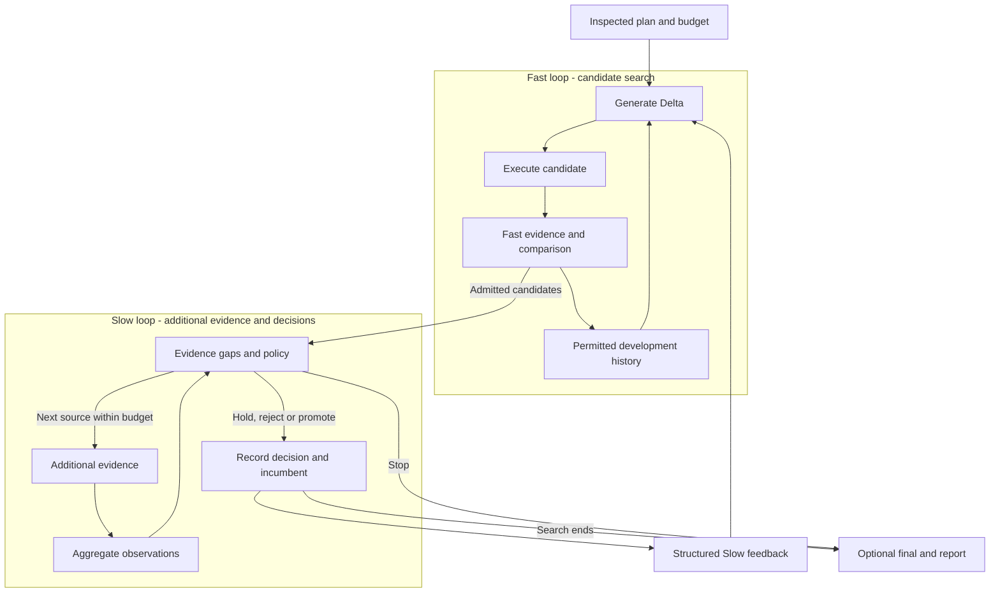

# DUO

Evaluate and optimize existing Agent components in DeepSeek Harness.

**English** · [简体中文](./README.zh-CN.md)

[Quickstart](./docs/QUICKSTART.md) · [Agent Guide](./dsh-plugin/AGENT_GUIDE.md) · [Documentation](./docs/README.md) · [Origins](./docs/THIRD_PARTY_NOTICES.md)

[](https://github.com/CZ-ZL/duo/actions/workflows/product.yml)

Supply a safely editable **Target**, an **Evaluator** and an authorized budget. DUO evaluates the original, generates candidates, records evidence, and explains why a version was selected or retained. If the objective is unclear, start with preparation to identify what is missing.

Evaluate only, optimize with one evidence source, or use two loops when additional evidence is available. **No improvement; retain the original** is a valid outcome. Candidates are never deployed automatically.

## Try a local example

Requires Linux, Node 24+ and an existing DSH installation. The native runtime needs neither Python nor a model account.

From the source checkout, set your installed DSH package path and choose an unused example directory:

```sh
export DUO_DSH_PACKAGE=/absolute/path/to/node_modules/@deepseek-ai/dsh
node dsh-plugin/bin/duo.mjs init --root /tmp/duo-demo --dsh-package "$DUO_DSH_PACKAGE" --example evaluate
node dsh-plugin/bin/duo.mjs call --root /tmp/duo-demo --tool dualloop_describe
node dsh-plugin/bin/duo.mjs call --root /tmp/duo-demo --tool dualloop_plan --args '{"view":"summary"}'
```

This creates an isolated example and shows its plan. Follow the [quickstart](./docs/QUICKSTART.md) to inspect the plan, run it and retrieve the report. The example measures local text formatting through real DSH tools at **CNY 0** inner cost. It demonstrates the product workflow, not LLM task quality.

For an existing profile, see [package installation](./dsh-plugin/README.md). Tested host versions and platform boundaries are recorded in [current capabilities](./dsh-plugin/CURRENT_STATUS.md) and the [release index](./docs/releases/README.md).

## Choose a mode

| Your need | Preset | Behavior |
|---|---|---|
| Measure the original first | `evaluate` | Evaluation only |
| Optimize with an available measurement | `optimize-basic` | Single-fidelity search and selection |
| Use Fast plus available additional evidence | `optimize-dual` | Dual-loop search, validation and feedback |
| Negotiate from connected capabilities | `optimize-auto` | Explicit mode and downgrade reporting in plan and result |

[Runnable examples](./dsh-plugin/examples/product/README.md) cover custom Targets, BYO Evaluators, component replacement and warm start. An arbitrary file is not automatically a supported Target: it needs a compatible adapter and measurement.

## How the two loops work



Fast iterates on development evidence. Slow identifies evidence gaps, acquires planned additional measurements and produces feedback for later search. One Controller schedules both loops; two resident Agents are not required. Final evidence never feeds back into search.

Slow does not mean a more expensive model. Broader coverage is labeled `expanded_evidence`; `high_fidelity` requires a stated basis relevant to the objective. Without additional evidence, basic optimization still runs and reports single fidelity. See the [architecture](./docs/ARCHITECTURE.md) and [evidence strategy](./dsh-plugin/EVIDENCE_STRATEGY.md).

## Integrate and extend

Target, Generator, Executor, Evaluator, comparison and promotion policies, feedback and history strategies compose through existing service interfaces. DSH/Cordis supplies models, tools, permissions and lifecycle. Public contracts and type declarations are documented in the [Provider guide](./dsh-plugin/PROVIDERS.md).

Providers are trusted in-process code. Recovery covers supported settled checkpoints. Review [capability boundaries](./dsh-plugin/CURRENT_STATUS.md) and [security guidance](./dsh-plugin/SECURITY.md) before use.

## Development, evidence and origins

- Development: [contributing](./CONTRIBUTING.md), [tests](./docs/development/TESTING.md), [repository layout](./docs/development/REPOSITORY_LAYOUT.md).
- Versions and acceptance: [release index](./docs/releases/README.md), [changelog](./docs/releases/CHANGELOG.md).
- Research: [historical results](./docs/research/EXPERIMENTS.md). Method research is paused. A general quality or total-cost advantage over a reasonable single loop has not been established; product acceptance does not establish method efficacy.

The two-loop approach was inspired by Wang et al.'s [*Self-Evolving Recommendation System*](https://arxiv.org/abs/2602.10226). DUO is an independent adaptation to Agent components and does not inherit the paper's experimental results. It runs on [DeepSeek Harness](https://github.com/deepseek-ai/deepseek-harness) and [Cordis](https://github.com/cordiverse/cordis). Code is [MIT licensed](./LICENSE); see [origins and third-party notices](./docs/THIRD_PARTY_NOTICES.md) for attribution.
