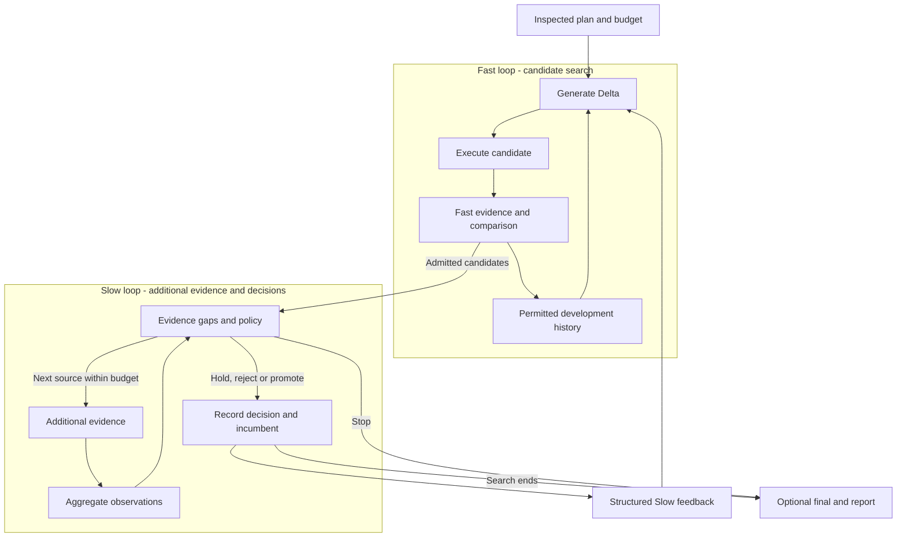

# DUO

**English** · [简体中文](./README.zh-CN.md)

[Quickstart](./dsh-plugin/QUICKSTART.md) · [Agent Guide](./dsh-plugin/AGENT_GUIDE.md) · [Documentation](./docs/README.md)

DUO is a DSH plugin that lets an Agent try changes, compare the original and each
candidate using supplied tests, and return the results, decisions and costs.

The calling Agent supplies a supported Target, an evaluator, model access when needed, and a
budget. DUO handles the repeated generation, execution, comparison and recording.
It leaves the original in place. Adopting a candidate requires the user's decision.

## A sample task

An Agent answering questions from a deployment runbook needs to return the
documented command, cite the source, and say when the document has no answer.

The [grounded-QA starter](./dsh-plugin/QUICKSTART.md#real-task-starter) supplies
an editable prompt, a runbook, four questions, an evaluator and the provider
configuration. The remaining inputs are the DSH path, supported model configuration,
work directory and authorized budget. DUO measures the original, asks the model for
one prompt change, executes that candidate and checks the answers.

The output includes the candidate Delta, per-task checks, selection reason, recorded usage
and a report. No improvement is a valid outcome. This starter uses basic mode:
it has development checks, without independent Slow or final evidence.
An independent Caller has completed this path using the public guide and owner-supplied
configuration; the [acceptance record](./docs/product-foundation/FIRST_USE.md) retains the steps.

## An actual result

In the **0.6.3 starter run below**, the original already answered all four
questions correctly. The model generated a prompt that required verbatim
extraction and explicit abstention when the runbook had no answer. DUO ran it,
measured the answers, and kept the original because the candidate did no better.

| Report item | Observed result |
|---|---|
| Candidate | `dl-0001`, generated from the original; a separate prompt overlay |
| Change | Require exact source extraction, no outside knowledge, and `NOT_IN_RUNBOOK` when the answer is absent |
| Development measurement | Original 4/4; candidate 4/4, with `starter-runbook-fast` evaluator v2 |
| Decision | Equal scores; retain the original. The Target file was unchanged |
| This run's inner model cost | 3 requests, **¥0.00735072**; local evaluation added no model requests |
| Independent confirmation | None: this basic run had no Slow or final test |

The [actual candidate, task checks, usage and source hashes](./docs/product-foundation/first-use/STARTER_RESULT.json)
are extracted from the retained run. The evaluator checks facts and citations;
a single inline-code wrapper does not make a correct command wrong. Calling
Agent inference and local compute are outside the inner cost above.

There was no measured gain in this run. The useful output is a tested candidate
and an inspectable reason to leave the original alone. [Earlier configuration
results](./docs/product-foundation/first-use/HISTORICAL_RESULT.json) and
[research results, failures and limitations](./docs/research/EXPERIMENTS.md)
remain available separately.

## Start here

Use the **[Quickstart](./dsh-plugin/QUICKSTART.md)**. Choose one path:

| Path | What it does |
|---|---|
| [Free installation check](./dsh-plugin/QUICKSTART.md#free-installation-check) | Install the package, discover capabilities, inspect a plan, run local text checks and save the report. No model requests; this checks the product flow. |
| [Real task starter](./dsh-plugin/QUICKSTART.md#real-task-starter) | Connect an authorized model and run the document-QA task above. Normally at most three inner model requests, with retries disabled; independently exercised through the public guide. |

Developer preview. Requires Linux, Node24+ and an existing DSH installation;
tested with DSH0.1.2-rc.1 / Cordis4.0.2. Installation does not configure a model
account or grant spending authority. DUO's ledger covers inner work, not every
request made by the Calling Agent.

## Capabilities

- **Custom tests.** Supply an evaluator or wrap an existing test function.
  The supplied evaluation rules define what counts as a useful result.
- **Candidate experiments.** Generate and compare changes; add further checks
  when evidence beyond the initial evaluation is available.
- **Reusable history.** Keep failed attempts, decisions and costs. Warm start
  can pass compatible development history to a later experiment.
- **Bounded execution.** Inspect the plan before running, enforce inner budget
  limits, stop on unknown costs and recover at supported settled checkpoints.

Prompt/persona overlays are supported. The configuration adapter is limited to
one fetch setting and needs matching execution providers; it is not arbitrary
configuration optimization. Other Targets need adapters and compatible work
providers. See [current support](./dsh-plugin/CURRENT_STATUS.md) and
[security boundaries](./dsh-plugin/SECURITY.md). Providers are trusted code in the
host process; DUO does not sandbox arbitrary plugins.

## How the two loops fit

Fast generates changes, tests them and uses the development results to guide the next attempt. Slow checks what remains untested, runs the additional measurements allowed by the plan, and sends feedback to later generations. One Controller schedules both loops. Final-test results stay out of search.

Additional tasks or boundary tests count as `expanded_evidence`. Calling evidence `high_fidelity` requires an explanation of why it better measures the objective; a higher model price is not enough. Without additional evidence, basic optimization still runs and reports that limitation. See the [architecture](./docs/ARCHITECTURE.md) and [evidence strategy](./dsh-plugin/EVIDENCE_STRATEGY.md).

## Integrate and extend

Changing what DUO tests requires a Target adapter and matching work providers. Candidate generation, evaluation, selection and history use also have replacement interfaces. The [Provider guide](./dsh-plugin/PROVIDERS.md) documents the interfaces and types. DSH/Cordis manages model access, tools, permissions and plugin lifecycle.

Warm start lets a later experiment reuse compatible development history. Final-test results stay out of search. Recovery at supported settled checkpoints keeps the original allowance.

Providers are trusted in-process code. Recovery covers supported settled checkpoints. Review [capability boundaries](./dsh-plugin/CURRENT_STATUS.md) and [security guidance](./dsh-plugin/SECURITY.md) before use.

## Development, evidence and origins

- Development: [contributing](./CONTRIBUTING.md), [tests](./docs/development/TESTING.md), [repository layout](./docs/development/REPOSITORY_LAYOUT.md).
- Versions and acceptance: [release index](./docs/releases/README.md), [changelog](./docs/releases/CHANGELOG.md).
- Research: [experiment results](./docs/research/EXPERIMENTS.md). Method research is paused while we focus on installation, use and extension. Passing the product tests shows that the workflow runs as intended.

The two-loop approach was inspired by Wang et al.'s [*Self-Evolving Recommendation System*](https://arxiv.org/abs/2602.10226). DUO is an independent adaptation to Agent components and does not inherit the paper's experimental results. It runs on [DeepSeek Harness](https://github.com/deepseek-ai/deepseek-harness) and [Cordis](https://github.com/cordiverse/cordis). Code is [MIT licensed](./LICENSE); see [origins and third-party notices](./docs/THIRD_PARTY_NOTICES.md) for attribution.
