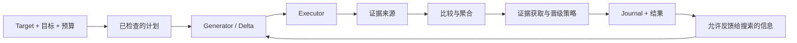

# DUO — 在 DSH 内评估和优化现有 Agent 组件

[English](README.md) · [简体中文](README.zh-CN.md)

[](https://github.com/CZ-ZL/duo/actions/workflows/product.yml)

DUO 是 DeepSeek Harness 的原生插件。调用方提供一个已有的 Agent 组件、可衡量的目标、Evaluator 和授权预算，便可以通过公开工具发现能力、检查计划、运行评估或优化，并取得候选、证据、决策、历史和费用记录。

**“没有改善，保留原版”是合法结果。** DUO 不自动部署候选。产品验收证明的是运行行为；目前尚未证明 DUO 相比合理单环具有普遍的质量或总费用优势。

**0.6.0 产品线**收敛了 Slow evidence 模式，修复选择与累计预算边界，并提供有类型约束的扩展接口。请查看[当前能力](CURRENT_STATUS.md)、[验收与待办](docs/slow-evidence-strategy/QUEUE.md)和[版本说明](RELEASE_NOTES_v0.6.0.md)。原有 [0.5.0 验收记录](PRODUCT_ACCEPTANCE.json)保持不变。

## 适合什么时候使用

当你已有可安全隔离修改的组件、明确的目标和可执行测量时，可以使用 DUO。目标或测量尚未准备好时，先完成准备与只评估流程。

| 已有条件 | 公开 preset | 执行内容 |
|---|---|---|
| Target 和 Evaluator | `evaluate` | 只测原版，不生成候选 |
| 目标、Evaluator、预算 | `optimize-basic` | 使用一个证据来源生成、评估和选择 |
| Fast 和可用的新增证据来源 | `optimize-dual` | 取得新增证据，再决定终局选择 |
| 新增证据可选 | `optimize-auto` | 协商可用模式，并明确说明降级 |

Slow 是**证据获取与决策策略**。它可以请求计划内的测量、搁置、淘汰、晋级或停止。新增证据根据声明的覆盖范围和校准依据，标记为 `expanded_evidence` 或 `high_fidelity`。没有信息增量时标记 `unavailable`，基础优化仍然可用。价格更高或模型更强，不会自动提高可信度。具体边界见[证据策略说明](dsh-plugin/EVIDENCE_STRATEGY.md)。

## 运行一个免费本地示例

需要 **Linux、Node 24+ 和已有 DSH 安装**。已验证的宿主目标为 DSH `0.1.2-rc.1`、Cordis `4.0.2`、Node `24.14.1`、pnpm `11.24.0`。原生运行不需要 Python 或模型账号。

在当前源码目录中，指定已有 DSH 包，并使用一个尚不存在的示例目录：

```sh
export DUO_DSH_PACKAGE=/absolute/path/to/node_modules/@deepseek-ai/dsh
node dsh-plugin/bin/duo.mjs init --root /tmp/duo-demo --dsh-package "$DUO_DSH_PACKAGE" --example optimize
node dsh-plugin/bin/duo.mjs call --root /tmp/duo-demo --tool dualloop_describe
node dsh-plugin/bin/duo.mjs call --root /tmp/duo-demo --tool dualloop_plan --args '{"view":"summary"}'
```

检查返回的计划，再复制其中准确的 `planDigest` 和 `runId`：

```sh
node dsh-plugin/bin/duo.mjs call --root /tmp/duo-demo --tool dualloop_run --args '{"planDigest":"PASTE_PLAN_DIGEST"}'
node dsh-plugin/bin/duo.mjs call --root /tmp/duo-demo --tool dualloop_report --args '{"runId":"PASTE_RUN_ID","view":"summary"}'
```

示例用确定性 provider，通过真实 DSH 工具测量本地文本格式，费用为 **¥0**；它没有测量 LLM Agent 的任务能力。`init` 拒绝覆盖已有目录，使用隔离 profile，保留原始 Target。调用、返回值和日志保存在示例目录内。

还可以选择 `--example evaluate`、`dual`、`byo`、`replace`、`warm` 或 `custom`。[示例指南](dsh-plugin/examples/product/README.md)说明了组件替换、接入自定义 Evaluator 和历史复用的步骤。

## 安装到自己的 DSH profile

从[私有 v0.6.0 Release](https://github.com/CZ-ZL/duo/releases/tag/v0.6.0) 下载已审查的 `dual-loop-dsh-plugin-0.6.0.tgz` 即可安装，也可从当前源码构建同一安装包：

```sh
cd dsh-plugin
npm pack --offline --ignore-scripts
```

将生成的压缩包安装到有权修改的 profile：

```sh
dsh plugin --profile YOUR_PROFILE add /absolute/path/dual-loop-dsh-plugin-0.6.0.tgz
dsh --profile YOUR_PROFILE --dump-config
```

安装过程可能下载 peer dependencies。宿主 profile 需要提供 application 和 tools。默认 DUO bundle 暴露准备能力，等待工作 provider 接入；它不会配置模型路线或授予消费权限。详见[包安装说明](dsh-plugin/README.zh-CN.md)与 [Agent 使用指南](AGENT_GUIDE.md)。本仓库不向 npm registry 发布包。

## 架构与扩展边界



Controller 管理共用生命周期、取消和支持范围内的恢复。DSH/Cordis 管理 provider 绑定、模型执行、工具、权限和卸载。扩展通过已有服务接口完成：

| 组件 | 职责 |
|---|---|
| Target | 快照、Delta 验证、内容身份和历史投影 |
| Generator / Executor | 提出修改 / 执行修改后的组件 |
| Evaluators | 产生带版本和费用回执的观测 |
| Comparator / Gate | 比较同范围证据、聚合判断、决定后续测量和选择 |
| Feedback / history | 提供允许进入搜索的观测，筛选 warm-start 历史 |
| Journal / Budget | 保留决策、账本、额度和已结算检查点 |

Persona overlay 在配有兼容工作 provider 时受支持。内置 plugin config 为**部分支持**：仅允许修改 fetch 的 `maxBodyChars`，并且需要配套 Executor/Evaluator。自定义 Target 可以实现公开接口，无需修改 Core。[Provider 协议](dsh-plugin/PROVIDERS.md)和随包提供的 TypeScript 声明说明了具体接口。

## 需要了解的边界

- Provider 是受信任的进程内代码。元数据声明不等于独立证明，也不提供操作系统隔离。
- Slow 只能请求冻结顺序中的下一个适用来源；不会自行创造测试、安装 provider 或计算期望信息增益。
- 恢复要求未变更、已结算的 baseline/generation 检查点，仍受原始截止时间约束；不会重放未决调用。
- 累计上限会计入未完成 run 的额度。未知费用会阻止受累计上限约束的准入。遗留准入锁需要检查 owner 和状态，不会被自动抢占。
- Warm start 只导入筛选后的搜索历史，不导入旧 final 分数、费用或权限。证据模式变化时，仅允许复用思路。
- 内层账本不覆盖 Calling Agent 的所有请求。Windows/macOS 和任意中断位置的恢复不在支持范围内。

## 开发与证据

```sh
npm ci --ignore-scripts --no-audit --no-fund
npm run format:check
npm run typecheck  # 需要设置 DUO_DSH_PACKAGE
bash scripts/release_gate.sh /tmp/new-duo-release-check
```

[TESTING.md](TESTING.md)分别说明原生回归、类型编译、隔离包与 DSH 验收、独立 Caller 使用和历史研究。[CONTRIBUTING.md](CONTRIBUTING.md)说明贡献流程，[RELEASING.md](RELEASING.md)说明交付流程。[代码整理记录](docs/slow-evidence-strategy/LEAN.md)保留修改理由与回归证据。

方法研究已暂停。[EXPERIMENTS.md](EXPERIMENTS.md)保留正式负结果及后续诊断；使用过的 final 数据仍标记为已消费，失败和费用不删除。本版本不增加 Graph/Bayesian、新 benchmark 或更多 loop。

Python 协议保留独立版本 `0.1.0`，通过显式 legacy 路径使用。项目代码采用 [MIT 许可](LICENSE)，宿主与数据集的归属见 [THIRD_PARTY_NOTICES.md](THIRD_PARTY_NOTICES.md)。
