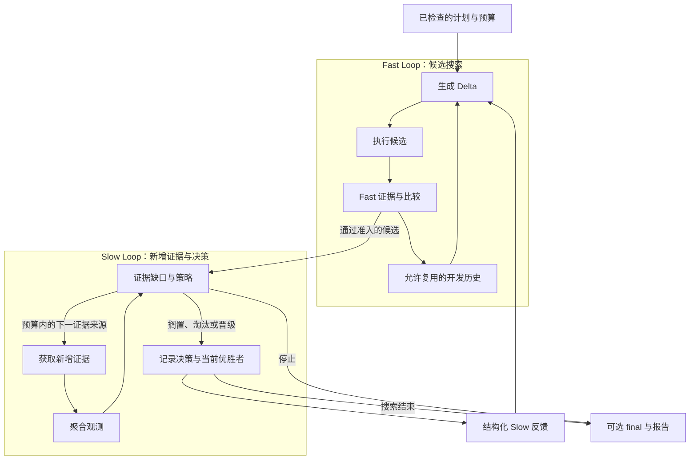

# DUO

用于 Agent 评估与预算内优化的 DeepSeek Harness（DSH）插件。

[English](./README.md) · **简体中文**

[快速开始](./docs/QUICKSTART.md) · [Agent 指南](./dsh-plugin/AGENT_GUIDE.md) · [文档](./docs/README.md) · [来源](./docs/THIRD_PARTY_NOTICES.md)

[](https://github.com/CZ-ZL/duo/actions/workflows/product.yml)

提供一个可安全修改的 **Target**、一个 **Evaluator** 和授权预算，DUO 就能评估原版、生成候选、记录证据，并解释为什么选择或保留某个版本。目标还不明确时，先通过准备流程补齐条件。

可以只评估，也可以优化；有新增证据时使用双环。**没有改善、保留原版是合法结果**，候选不会自动部署。

## 让你的 Agent 使用

可以这样说：**“先用现有测试评估这个 Agent，再在预算内比较改动，不要替换原版。”** DUO 支持自定义评估器、候选比较和兼容历史复用。目标或成功标准不清楚时，先引导准备，不直接开始优化。

把[固定版本插件包](./dsh-plugin/README.zh-CN.md)装入 DSH profile 后，Agent 从 `dualloop_describe` 开始，按授权准备、检查计划和执行。仓库根目录是开发工具包；应安装 **`dsh-plugin` 组合包**，不要直接安装 `github:CZ-ZL/duo`。社区目录收录进度见[分发记录](./docs/product-foundation/DISTRIBUTION.md)。

## 先运行一个本地示例

需要 Linux、Node 24+ 和已有 DSH 安装。原生运行不需要 Python 或模型账号。

在源码目录中，填写已有 DSH 包的路径，并使用尚不存在的示例目录：

```sh
export DUO_DSH_PACKAGE=/absolute/path/to/node_modules/@deepseek-ai/dsh
node dsh-plugin/bin/duo.mjs init --root /tmp/duo-demo --dsh-package "$DUO_DSH_PACKAGE" --example evaluate
node dsh-plugin/bin/duo.mjs call --root /tmp/duo-demo --tool dualloop_describe
node dsh-plugin/bin/duo.mjs call --root /tmp/duo-demo --tool dualloop_plan --args '{"view":"summary"}'
```

这会建立隔离示例并展示计划。按照[快速开始](./docs/QUICKSTART.md)检查计划、执行并读取报告。示例通过真实 DSH 工具测量本地文本格式，内层费用 **¥0**；它是产品流程演示，不是 LLM 任务能力测试。

已有 profile 的安装方式见[包安装说明](./dsh-plugin/README.zh-CN.md)。已验证的宿主版本与平台边界见[当前能力](./dsh-plugin/CURRENT_STATUS.md)和[发布索引](./docs/releases/README.md)。

## 选择适合的模式

| 你的需要 | Preset | 行为 |
|---|---|---|
| 先了解原版表现 | `evaluate` | 只执行评估 |
| 有一个可用测量，开始优化 | `optimize-basic` | 单保真搜索与选择 |
| 有 Fast 和可用的新增证据 | `optimize-dual` | 双环搜索、验证与反馈 |
| 根据已接入能力选择模式 | `optimize-auto` | 在计划和结果中明确说明模式及降级 |

自定义 Target、Evaluator、组件替换和 warm start 均有[可运行示例](./dsh-plugin/examples/product/README.md)。任意文件并不自动成为受支持的 Target；它需要兼容的适配器和测量。

## 两条回路如何协作



Fast 用开发证据反复搜索；Slow 判断证据缺口、获取计划内的新增测量并形成后续反馈。两者由同一个 Controller 调度，不要求两个常驻 Agent。Final 证据不反馈搜索。

Slow 不等于更贵的模型。扩大覆盖的测量标记为 `expanded_evidence`；有目标相关依据时才标记 `high_fidelity`。没有新增证据时，基础优化仍可运行，并明确标记为单保真。详见[架构](./docs/ARCHITECTURE.md)和[证据策略](./dsh-plugin/EVIDENCE_STRATEGY.md)。

## 接入与扩展

Target、Generator、Executor、Evaluator、比较与晋级策略、反馈和历史策略通过已有服务接口组合。DSH/Cordis 提供模型、工具、权限和生命周期。公开协议与类型声明见 [Provider 指南](./dsh-plugin/PROVIDERS.md)。

Provider 是受信任的进程内代码；恢复仅覆盖支持的已结算检查点。使用前查阅[能力边界](./dsh-plugin/CURRENT_STATUS.md)与[安全说明](./dsh-plugin/SECURITY.md)。

## 开发、证据与来源

- 开发：[贡献说明](./CONTRIBUTING.md)、[测试](./docs/development/TESTING.md)、[目录说明](./docs/development/REPOSITORY_LAYOUT.md)。
- 版本与验收：[发布索引](./docs/releases/README.md)、[变更记录](./docs/releases/CHANGELOG.md)。
- 研究：[历史结果](./docs/research/EXPERIMENTS.md)。方法研究已暂停，目前没有证明 DUO 相比合理单环具有普遍的质量或总费用优势；产品验收不代表方法有效性。

双环思路受 Wang 等人的 [*Self-Evolving Recommendation System*](https://arxiv.org/abs/2602.10226) 启发。DUO 是独立的 Agent 组件适配，不继承论文的实验结论。运行基础为 [DeepSeek Harness](https://github.com/deepseek-ai/deepseek-harness) 和 [Cordis](https://github.com/cordiverse/cordis)。代码采用 [MIT 许可](./LICENSE)，详细归属见[来源与第三方说明](./docs/THIRD_PARTY_NOTICES.md)。
