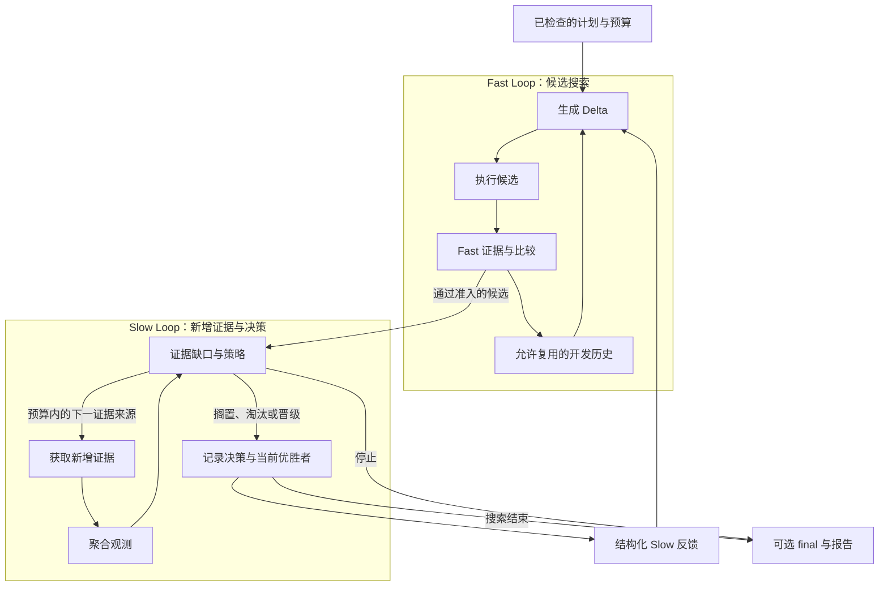

# DUO

[English](./README.md) · **简体中文**

[快速开始](./dsh-plugin/QUICKSTART.zh-CN.md) · [Agent Guide](./dsh-plugin/AGENT_GUIDE.md) · [文档目录](./docs/README.md)

DUO 是一个 DSH 插件：让 Agent 尝试修改，按提供的测试比较原版和候选，
最后交付结果、选择依据和费用。

调用方提供受支持的修改对象、评估器、必要的模型接入和预算。DUO 负责反复生成、
执行、比较和记录。原版保留，是否采用候选由用户决定。

## 可以交给它什么任务

比如，一个根据部署手册回答问题的 Agent，需要给出文档中的正确命令，
附上来源，文档没有答案时就明确说没有。

[文档问答 starter](./dsh-plugin/QUICKSTART.zh-CN.md#真实任务-starter)
提供可编辑的提示词、手册、四道题、评估器和 provider 配置。调用方只需填写 DSH
路径、受支持的模型配置、工作目录和授权预算。DUO 先测原版，让模型提出一次
提示词修改，再执行候选、检查答案。

交付物包括候选 Delta、逐题检查、选择依据、实际用量和报告。没有改善也是
有效结果。这个 starter 使用 basic 模式，只有开发测量，没有独立 Slow 或
final。独立 Caller 已仅凭公开指南与用户配置跑通这条路径，步骤保留在
[验收记录](./docs/product-foundation/FIRST_USE.md)。

## 一份实际结果

下面来自 **0.6.3 的真实 starter 运行**。原版已经答对四道题。模型生成的新提示词
要求逐字提取来源、禁止使用外部知识，并在文档缺少答案时明确拒答。DUO 执行并
测量了这个候选；它没有比原版更好，所以最终保留原版。

| 报告内容 | 实际记录 |
|---|---|
| 候选 | `dl-0001`，从原版生成，保存在独立的提示词 overlay 中 |
| 改了什么 | 要求精确提取来源、不使用外部知识，缺少答案时返回 `NOT_IN_RUNBOOK` |
| 开发测量 | 原版 4/4；候选 4/4，使用 `starter-runbook-fast` 评估器 v2 |
| 选择依据 | 两者平分，保留原版；Target 文件未变 |
| 本次内层模型费用 | 3 次请求，**¥0.00735072**；本地评分未增加模型请求 |
| 独立确认 | 没有：本次 basic 运行未配置 Slow 或 final |

[实际候选、逐题检查、用量与来源哈希](./docs/product-foundation/first-use/STARTER_RESULT.json)
从运行产物中提取。评估器检查事实与引用；正确命令外的一层行内代码反引号不算
事实错误。上面的费用不包含 Calling Agent 自身推理和本地计算。

这次没有测到提升，但交付了一个实际测过的候选，以及保留原版的具体依据。
[历史配置实验](./docs/product-foundation/first-use/HISTORICAL_RESULT.json)与
[研究结果、失败和限制](./docs/research/EXPERIMENTS.md)仍单独保留。

## 从这里开始

打开 **[Quickstart](./dsh-plugin/QUICKSTART.zh-CN.md)**，选择一条路径：

| 路径 | 做什么 |
|---|---|
| [免费安装检查](./dsh-plugin/QUICKSTART.zh-CN.md#免费安装检查) | 安装包、检查能力、查看计划、运行本地文本检查并保存报告。不调用模型，验证产品流程。 |
| [真实任务 starter](./dsh-plugin/QUICKSTART.zh-CN.md#真实任务-starter) | 接入已授权的模型，运行上述文档问答任务。正常最多 3 次内层模型请求，关闭重试；已由独立 Caller 按公开指南运行。 |

当前为开发者预览版，需要 Linux、Node24+ 和已有 DSH 安装，
已验证 DSH0.1.2-rc.1 / Cordis4.0.2。安装不会配置模型账号或授予消费权限。
DUO 账本覆盖内层工作，不包含 Calling Agent 的全部请求。

## 可以怎么用

- **接入现有测试。** 提供评估器，或包装已有测试函数，按设定的规则判断结果是否值得保留。
- **试改并比较。** 生成候选、执行评估；有额外证据时，再对候选补测。
- **复用历史。** 保留失败、决策和费用；后续实验可通过 warm start 使用兼容的开发历史。
- **控制执行边界。** 先看计划，再按内层预算运行；费用未知时停止，在支持的已结算检查点恢复。

当前支持 prompt/persona overlay。配置适配器只覆盖一个 fetch 字段，还需
匹配的执行 provider，不是任意配置优化。其他 Target 要提供适配器和兼容组件。
详细范围见[当前支持](./dsh-plugin/CURRENT_STATUS.md)和
[安全说明](./dsh-plugin/SECURITY.md)。Provider 是宿主进程中的可信代码，
DUO 不为任意插件提供沙箱。

## 两条回路如何协作

Fast 生成改法、跑测试，再用开发集上的结果指导下一次尝试。Slow 看还有哪些情况没测过，在计划允许的范围内补测，并把反馈交给后续几代。两个回路由同一个 Controller 调度。最终测试的结果不会进入搜索。

多跑一些任务或边界测试，记为 `expanded_evidence`。要称为 `high_fidelity`，还需要说明它为什么更接近实际目标；模型更贵本身不算依据。没有新增证据时，仍可用基础优化模式，报告里会说明这个限制。详见[架构](./docs/ARCHITECTURE.md)和[证据策略](./dsh-plugin/EVIDENCE_STRATEGY.md)。

## 接入与扩展

要换优化对象，需要提供 Target 适配器和匹配的执行组件。候选怎么生成、怎么评估和选择、如何使用历史，也有对应的替换接口，见 [Provider 指南](./dsh-plugin/PROVIDERS.md)。模型接入、工具、权限和插件生命周期由 DSH/Cordis 管理。

做下一次实验时，可以通过 warm start 复用兼容的开发历史。最终测试的结果不会混进搜索。在支持的已结算检查点恢复运行，也会沿用原有额度。

Provider 是受信任的进程内代码；恢复仅覆盖支持的已结算检查点。使用前查阅[能力边界](./dsh-plugin/CURRENT_STATUS.md)与[安全说明](./dsh-plugin/SECURITY.md)。

## 开发、证据与来源

- 开发：[贡献说明](./CONTRIBUTING.md)、[测试](./docs/development/TESTING.md)、[目录说明](./docs/development/REPOSITORY_LAYOUT.md)。
- 版本与验收：[发布索引](./docs/releases/README.md)、[变更记录](./docs/releases/CHANGELOG.md)。
- 研究：[实验结果](./docs/research/EXPERIMENTS.md)。方法研究已暂停，目前先把安装、使用和扩展这几件事做好。产品测试通过，只说明这套流程能按预期运行。

双环思路受 Wang 等人的 [*Self-Evolving Recommendation System*](https://arxiv.org/abs/2602.10226) 启发。DUO 是独立的 Agent 组件适配，不继承论文的实验结论。运行基础为 [DeepSeek Harness](https://github.com/deepseek-ai/deepseek-harness) 和 [Cordis](https://github.com/cordiverse/cordis)。代码采用 [MIT 许可](./LICENSE)，详细归属见[来源与第三方说明](./docs/THIRD_PARTY_NOTICES.md)。
