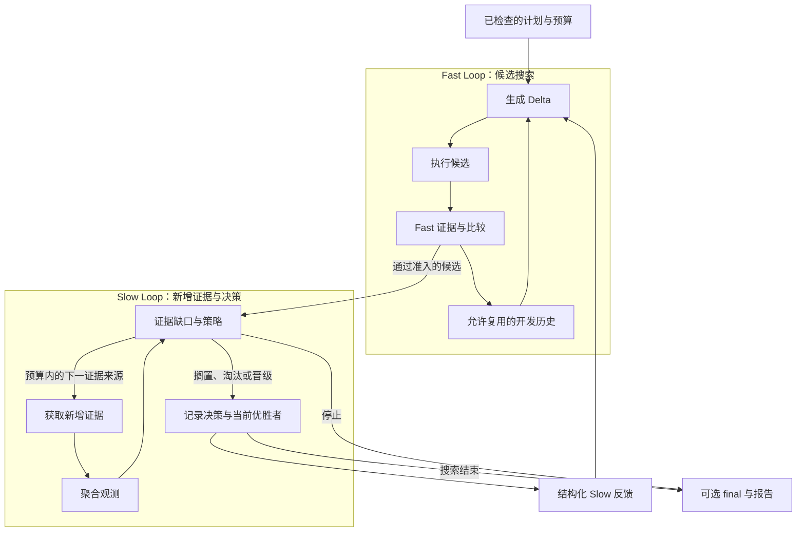

# DUO

[English](./README.md) · **简体中文**

[安装使用](./dsh-plugin/README.zh-CN.md) · [Agent 指南](./dsh-plugin/AGENT_GUIDE.md) · [文档](./docs/README.md) · [来源](./docs/THIRD_PARTY_NOTICES.md)

[](https://github.com/CZ-ZL/duo/actions/workflows/product.yml)

DUO 是一个 DeepSeek Harness（DSH）插件，用来试改 Agent 的提示词或支持的组件配置。你给它测试方法和预算，它负责测原版、生成候选、跑测试，留下每个版本的改动、结果和花费。

也可以先只测原版，看过结果再决定要不要继续改。试了一轮没有更好的版本，就保留原版。是否采用某次改动，由你决定。

## 它会帮你做哪些事

Agent 可以通过 DUO 的工具准备实验、给你看计划、运行并读取报告，使用 DSH 已经接好的模型、工具和权限。

- 用你的测试判断好坏。评估器、Target 适配器、候选生成器和选择策略都能按公开接口替换。
- 先筛选，再补测。Fast 跑初步测试；符合条件的候选再由 Slow 按计划补测，反馈给后续尝试。没有额外测试，也能使用基础优化模式。
- 失败的尝试也留下来。你能查到每次改了什么、得了多少分、为什么被选中或淘汰，以及费用凭据。费用不明时，后续付费操作会停下；调用 DUO 的 Agent 自身费用需要宿主另设预算。
- 下次实验可以接着用兼容的开发历史。最终测试的结果不会反馈给搜索；在支持的已结算检查点恢复运行时，沿用原来的额度。

还没想好目标或测试方法时，准备工具会列出缺少的条件。能改哪些东西取决于接入的适配器；提示词、部分配置字段和自定义适配器的要求见[当前支持范围](./dsh-plugin/CURRENT_STATUS.md)。

## 让你的 Agent 使用

插件和执行组件接好后，你可以这样说：

> “拿我现有的测试跑一下这个 Agent，看看哪里没过。然后试几种改法，最多花 2 块钱，给我看结果。先别替换原版。”

把[插件包](./dsh-plugin/README.zh-CN.md)装入 DSH profile 后，让 Agent 先调用 `dualloop_describe`，看看哪些能力可用、还缺什么配置。[Agent 指南](./dsh-plugin/AGENT_GUIDE.md)说明了怎么接模型和评估器，以及如何查看计划、运行和取回结果。

安装时用指南里的 Release 包。插件在 `dsh-plugin/`，仓库根目录用于开发。社区目录的收录进度见[分发记录](./docs/product-foundation/DISTRIBUTION.md)。

## 和同类工具怎么选？

这些工具有不少重叠，下面按使用场景区分，不排性能高低。链接中的官方资料核对于 2026 年 9 月 16 日。

| 工具 | 公开功能侧重 | 可以优先考虑的场景 |
|---|---|---|
| [Promptfoo](https://www.promptfoo.dev/docs/intro/) | 评估与红队测试、自定义断言、结果对比和 CI 集成。 | 主要需求是测试、比较 LLM 应用的行为。 |
| [DSPy](https://dspy.ai/diving-deeper/choosing-an-optimizer/) | 编写 LM 程序，按指标优化指令、示例，或通过合适的优化器调整模型权重。 | 已在 DSPy 中开发，希望优化框架内的程序。 |
| [GEPA / optimize_anything](https://gepa-ai.github.io/gepa/api/optimize_anything/optimize_anything/) | 根据评分与反馈搜索文本形式的候选，支持配置优化引擎和预算，也提供 [Agent skill](https://gepa-ai.github.io/gepa/guides/agent-skill/)。 | 需要优化提示词、代码或其他可表示为文本的对象。 |
| DUO | 在 DSH 中试改候选、按需补测，记录结果和花费。 | 已在用 DSH，希望让 Agent 通过工具完成这些实验。 |

这里选择 DUO 的主要理由是它接在 DSH 里。其他工具也有 Agent 接口、扩展机制和预算控制。DUO 目前是开发者预览版，支持提示词和部分配置字段，其他对象需要自定义适配器。

## 先运行一个本地示例

需要 Linux、Node 24+ 和已有 DSH 安装。原生运行不需要 Python 或模型账号。

在源码目录中，填写已有 DSH 包的路径，并使用尚不存在的示例目录：

```sh
export DUO_DSH_PACKAGE=/absolute/path/to/node_modules/@deepseek-ai/dsh
node dsh-plugin/bin/duo.mjs init --root /tmp/duo-demo --dsh-package "$DUO_DSH_PACKAGE" --example evaluate
node dsh-plugin/bin/duo.mjs call --root /tmp/duo-demo --tool dualloop_describe
node dsh-plugin/bin/duo.mjs call --root /tmp/duo-demo --tool dualloop_plan --args '{"view":"summary"}'
```

这会建立隔离示例并展示计划。接着按[快速开始](./docs/QUICKSTART.md)运行、读取报告。示例用 DSH 工具检查本地文本格式，不调用模型，也不产生模型费用；可以用它熟悉流程，但它不测 LLM 的任务能力。

已有 profile 的安装方式见[包安装说明](./dsh-plugin/README.zh-CN.md)。已验证的宿主版本与平台边界见[当前能力](./dsh-plugin/CURRENT_STATUS.md)和[发布索引](./docs/releases/README.md)。

## 选择适合的模式

| 你的需要 | Preset | 行为 |
|---|---|---|
| 先了解原版表现 | `evaluate` | 只执行评估 |
| 用现有测试尝试改进 | `optimize-basic` | 生成、测试并选择候选 |
| 初筛后还有额外测试可跑 | `optimize-dual` | Fast 搜索，Slow 补测并反馈 |
| 根据已接入的组件选择模式 | `optimize-auto` | 把选定模式和降级情况写入计划与结果 |

自定义 Target、Evaluator、组件替换和 warm start 均有[可运行示例](./dsh-plugin/examples/product/README.md)。任意文件并不自动成为受支持的 Target；它需要兼容的适配器和测量。

## 两条回路如何协作



Fast 生成改法、跑测试，再用开发集上的结果指导下一次尝试。Slow 看还有哪些情况没测过，在计划允许的范围内补测，并把反馈交给后续几代。两个回路由同一个 Controller 调度。最终测试的结果不会进入搜索。

多跑一些任务或边界测试，记为 `expanded_evidence`。要称为 `high_fidelity`，还需要说明它为什么更接近实际目标；模型更贵本身不算依据。没有新增证据时，仍可用基础优化模式，报告里会说明这个限制。详见[架构](./docs/ARCHITECTURE.md)和[证据策略](./dsh-plugin/EVIDENCE_STRATEGY.md)。

## 接入与扩展

要换优化对象，需要提供 Target 适配器和匹配的执行组件。候选怎么生成、怎么评估和选择、如何使用历史，也有对应的替换接口，见 [Provider 指南](./dsh-plugin/PROVIDERS.md)。模型接入、工具、权限和插件生命周期由 DSH/Cordis 管理。

Provider 是受信任的进程内代码；恢复仅覆盖支持的已结算检查点。使用前查阅[能力边界](./dsh-plugin/CURRENT_STATUS.md)与[安全说明](./dsh-plugin/SECURITY.md)。

## 开发、证据与来源

- 开发：[贡献说明](./CONTRIBUTING.md)、[测试](./docs/development/TESTING.md)、[目录说明](./docs/development/REPOSITORY_LAYOUT.md)。
- 版本与验收：[发布索引](./docs/releases/README.md)、[变更记录](./docs/releases/CHANGELOG.md)。
- 研究：[实验结果](./docs/research/EXPERIMENTS.md)。研究已暂停。已有实验尚未证明 DUO 相比合理单环有普遍的质量或总费用优势。产品测试通过，只说明这套流程能按预期运行。

双环思路受 Wang 等人的 [*Self-Evolving Recommendation System*](https://arxiv.org/abs/2602.10226) 启发。DUO 是独立的 Agent 组件适配，不继承论文的实验结论。运行基础为 [DeepSeek Harness](https://github.com/deepseek-ai/deepseek-harness) 和 [Cordis](https://github.com/cordiverse/cordis)。代码采用 [MIT 许可](./LICENSE)，详细归属见[来源与第三方说明](./docs/THIRD_PARTY_NOTICES.md)。
