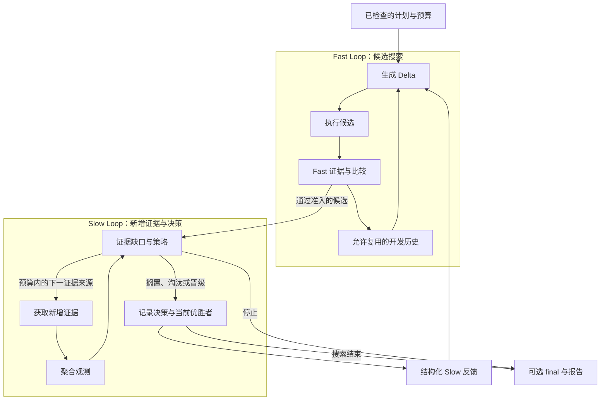

# DUO

**让 Agent 尝试改进，把每次改动、测试结果和花费交给你。**

[English](./README.md) · **简体中文**

[安装使用](./dsh-plugin/README.zh-CN.md) · [Agent 指南](./dsh-plugin/AGENT_GUIDE.md) · [文档](./docs/README.md) · [来源](./docs/THIRD_PARTY_NOTICES.md)

[](https://github.com/CZ-ZL/duo/actions/workflows/product.yml)

调整一个 Agent，往往还要反复跑测试、比较版本、核对花费。**DUO 是 DeepSeek Harness（DSH）的插件，把这些步骤连成一套有记录、可重复的流程。**

你指定要调整的提示词或受支持的组件配置、判断好坏的规则，以及预算。DUO 先测原版，再生成并测试不同改法，最后交付候选版本、评估结果和费用记录，供你决定是否采用。证据不足以支持替换时，可以保留原版；真正应用改动由你决定。

## 为什么选择 DUO？

如果你已经在使用 DSH，希望让 Agent 通过公开工具完成改进实验，并能检查计划、追溯每次决策，DUO 就是为这种场景准备的。

| 特点 | 对你有什么用 |
|---|---|
| **Agent 直接操作，原生接入 DSH** | 通过公开工具发现能力、补齐条件、检查计划、执行和读取报告，复用 DSH 的模型、工具和权限服务。 |
| **搜索改法与补充验证分工明确** | Fast 用现有测试筛选改法；Slow 按预先确定的计划为入选候选补测更多任务或边界情况，并将允许的反馈用于后续搜索。没有额外证据也能运行，结果会明确注明。 |
| **用你的测试，按需换组件** | 接入可执行的自定义评估器；通过支持的接口替换 Target 适配器、Generator 或选择策略。改变测试对象和候选选择方式，无需修改 DUO Core。 |
| **每次尝试都有预算和记录** | 查看具体改动、结果、失败、选择理由与内层操作的费用凭据。费用未知时停止付费操作；调用 DUO 的 Agent 自身费用由宿主另行预算。 |
| **历史可复用，边界说清楚** | Warm start 筛选兼容的开发历史；final 证据不进入搜索。在支持的已结算检查点恢复时，保留原有额度。 |

你也可以先只评估。目标或测试还不清楚时，调用 DUO 的 Agent 会通过准备工具帮你明确缺少什么，再安排执行。可修改范围由接入的适配器决定；[当前支持范围](./dsh-plugin/CURRENT_STATUS.md)列出了提示词、范围受限的配置目标，以及自定义适配器的要求。

## 让你的 Agent 使用

例如，你可以提出这样的需求：

> “先看看这个 Agent 在哪些现有测试上失败。再在 ¥2 预算内尝试改进，给我看结果和花费，先不要改动原版。”

把[固定版本插件包](./dsh-plugin/README.zh-CN.md)装入 DSH profile 后，Agent 从 `dualloop_describe` 开始，通过公开工具检查适用性、补齐测试和执行组件、确认计划，在授权范围内运行并读取报告。模型和可执行评估器需要接入，具体步骤见 [Agent 指南](./dsh-plugin/AGENT_GUIDE.md)。

请使用上方安装说明中的 Release 包：可安装插件位于 `dsh-plugin/`，仓库根目录用于开发。社区目录收录进度见[分发记录](./docs/product-foundation/DISTRIBUTION.md)。

## 和同类工具怎么选？

这些工具的能力存在重叠。下面按公开功能和使用场景比较，不是性能排名；官方资料核对于 2026 年 9 月 16 日。

| 工具 | 公开功能侧重 | 可以优先考虑的场景 |
|---|---|---|
| [Promptfoo](https://www.promptfoo.dev/docs/intro/) | 评估与红队测试、自定义断言、结果对比和 CI 集成。 | 主要需求是测试、比较 LLM 应用的行为。 |
| [DSPy](https://dspy.ai/diving-deeper/choosing-an-optimizer/) | 编写 LM 程序，按指标优化指令、示例，或通过合适的优化器调整模型权重。 | 已在 DSPy 中开发，希望优化框架内的程序。 |
| [GEPA / optimize_anything](https://gepa-ai.github.io/gepa/api/optimize_anything/optimize_anything/) | 根据评分与反馈搜索文本形式的候选，支持配置优化引擎和预算，也提供 [Agent skill](https://gepa-ai.github.io/gepa/guides/agent-skill/)。 | 需要优化提示词、代码或其他可表示为文本的对象。 |
| **DUO** | 把候选搜索、可选的新增证据、可替换策略和预算凭据接入 DSH 原生实验流程。 | 已使用 DSH，希望由 Agent 在预算内尝试改进受支持的组件，并交付可检查的结果。 |

DUO 的侧重点是把这套流程组合在 DSH 内。Agent 调用、可扩展和预算控制属于共有能力，不作为独占卖点。当前仍是开发者预览：支持提示词，内置配置适配器范围有限，其他对象需要适配器；尚未证明普遍的质量或费用优势。

## 先运行一个本地示例

需要 Linux、Node 24+ 和已有 DSH 安装。原生运行不需要 Python 或模型账号。

在源码目录中，填写已有 DSH 包的路径，并使用尚不存在的示例目录：

```sh
export DUO_DSH_PACKAGE=/absolute/path/to/node_modules/@deepseek-ai/dsh
node dsh-plugin/bin/duo.mjs init --root /tmp/duo-demo --dsh-package "$DUO_DSH_PACKAGE" --example evaluate
node dsh-plugin/bin/duo.mjs call --root /tmp/duo-demo --tool dualloop_describe
node dsh-plugin/bin/duo.mjs call --root /tmp/duo-demo --tool dualloop_plan --args '{"view":"summary"}'
```

这会建立隔离示例并展示计划。按照[快速开始](./docs/QUICKSTART.md)检查计划、执行并读取报告。示例通过真实 DSH 工具测量本地文本格式，内层费用 **¥0**；它是产品流程演示，不是 LLM 任务能力测试。

已有 profile 的安装方式见[包安装说明](./dsh-plugin/README.zh-CN.md)。已验证的宿主版本与平台边界见[当前能力](./dsh-plugin/CURRENT_STATUS.md)和[发布索引](./docs/releases/README.md)。

## 选择适合的模式

| 你的需要 | Preset | 行为 |
|---|---|---|
| 先了解原版表现 | `evaluate` | 只执行评估 |
| 有一个可用测量，开始优化 | `optimize-basic` | 单保真搜索与选择 |
| 有 Fast 和可用的新增证据 | `optimize-dual` | 双环搜索、验证与反馈 |
| 根据已接入能力选择模式 | `optimize-auto` | 在计划和结果中明确说明模式及降级 |

自定义 Target、Evaluator、组件替换和 warm start 均有[可运行示例](./dsh-plugin/examples/product/README.md)。任意文件并不自动成为受支持的 Target；它需要兼容的适配器和测量。

## 两条回路如何协作



Fast 用开发证据反复搜索；Slow 判断证据缺口、获取计划内的新增测量并形成后续反馈。两者由同一个 Controller 调度，不要求两个常驻 Agent。Final 证据不反馈搜索。

Slow 不等于更贵的模型。扩大覆盖的测量标记为 `expanded_evidence`；有目标相关依据时才标记 `high_fidelity`。没有新增证据时，基础优化仍可运行，并明确标记为单保真。详见[架构](./docs/ARCHITECTURE.md)和[证据策略](./dsh-plugin/EVIDENCE_STRATEGY.md)。

## 接入与扩展

Target、Generator、Executor、Evaluator、比较与晋级策略、反馈和历史策略通过已有服务接口组合。DSH/Cordis 提供模型、工具、权限和生命周期。公开协议与类型声明见 [Provider 指南](./dsh-plugin/PROVIDERS.md)。

Provider 是受信任的进程内代码；恢复仅覆盖支持的已结算检查点。使用前查阅[能力边界](./dsh-plugin/CURRENT_STATUS.md)与[安全说明](./dsh-plugin/SECURITY.md)。

## 开发、证据与来源

- 开发：[贡献说明](./CONTRIBUTING.md)、[测试](./docs/development/TESTING.md)、[目录说明](./docs/development/REPOSITORY_LAYOUT.md)。
- 版本与验收：[发布索引](./docs/releases/README.md)、[变更记录](./docs/releases/CHANGELOG.md)。
- 研究：[历史结果](./docs/research/EXPERIMENTS.md)。方法研究已暂停，目前没有证明 DUO 相比合理单环具有普遍的质量或总费用优势；产品验收不代表方法有效性。

双环思路受 Wang 等人的 [*Self-Evolving Recommendation System*](https://arxiv.org/abs/2602.10226) 启发。DUO 是独立的 Agent 组件适配，不继承论文的实验结论。运行基础为 [DeepSeek Harness](https://github.com/deepseek-ai/deepseek-harness) 和 [Cordis](https://github.com/cordiverse/cordis)。代码采用 [MIT 许可](./LICENSE)，详细归属见[来源与第三方说明](./docs/THIRD_PARTY_NOTICES.md)。
