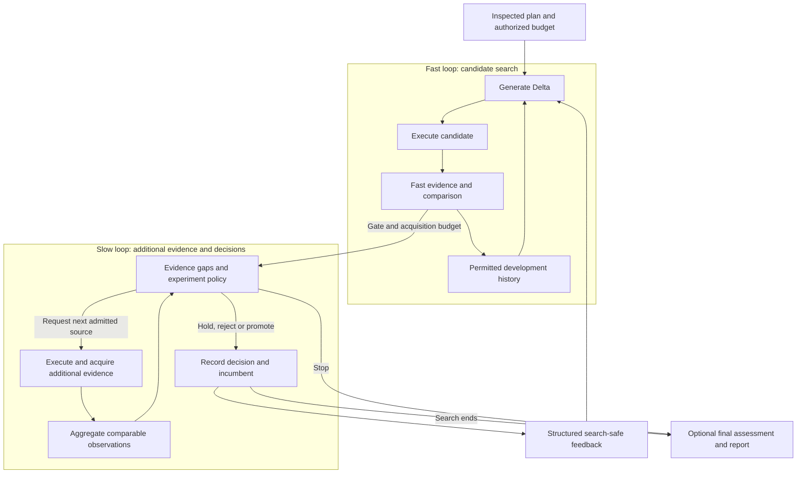

# Current DUO architecture

This page maps the native 0.6.1 implementation. [DESIGN.md](./history/DESIGN.md) preserves
the original design and its earlier Python bridge plan; the default product now
runs in JavaScript inside DSH.

## What makes this a dual loop?

The **Fast loop** proposes structured Deltas, executes candidates, measures them
with development evidence, and uses permitted history to guide later proposals.
The **Slow loop** admits a subset for additional evidence, aggregates the
observations and decides whether to hold, reject, promote or stop. Its allowed
feedback then changes the information available to later Fast generations.

The arrows describe information flow across settled stages and generations, not
parallel processes or instantaneous retries. One Controller schedules both
loops. Slow acquisition follows the frozen stage order, candidate quotas and
budget; it does not create an evaluator or run an unconstrained evidence search.
An optional intermediate `review` stage is still part of this acquisition path,
not a third optimization loop. Final assessment stays outside search feedback.

The Fast history return and the Slow decision return were collapsed into one
arrow in the earlier README. That was a lifecycle summary, not an adequate
explanation of the dual-loop mechanism.

## Which mode actually ran?

| Configuration | Behavior and honest label |
|---|---|
| `evaluate` | Execute and measure the original Target only; no candidate search |
| `optimize-basic` | Fast search using available evidence; `single_fidelity`, Slow `unavailable` |
| `optimize-dual` with wider same-family coverage | Additional measurements; Slow `expanded_evidence` |
| `optimize-dual` with qualified closer-to-objective evidence | Slow `high_fidelity`; price alone never qualifies it |
| `optimize-dual` without information increment | Structured preparation failure |
| `optimize-auto` without additional evidence | Explicit single-fidelity limitation in plan, Journal and result |

Negotiating dual-loop mode does not prove a candidate received Slow evidence:
the gate may admit none. Inspect actual acquisition receipts and the report's
`additional_evidence_acquired` state. A usable product run is not automatically
complete dual-loop validation or evidence of optimization benefit.

## Code and plugin boundaries

Paths below are under [`dsh-plugin/native/`](../dsh-plugin/native/).

| Responsibility | Implementation | Replacement boundary |
|---|---|---|
| Discovery, preparation and contracts | `capabilities.js`, `onboarding.js`, `contract.js`, `provider-contract.js`, `evaluator-discovery.js` | Public tools and versioned descriptors; one capability catalog |
| Snapshot, Delta and content identity | `target-protocol.js`, `target.js`, `config-target.js` | TargetService; persona/config are adapters, not the meaning of Target |
| Candidate proposals and execution | `model-generator.js`, `structured-generator.js`, `model-executor.js` | GeneratorService and ExecutorService; real or local adapters |
| Measurements and source semantics | `function-evaluators.js`, `evidence-source.js` | EvaluatorsService; evidence provenance and cost receipts |
| Comparison and aggregation | `comparator.js`, `evidence-strategy.js` | ComparatorService `compare` / `aggregate` |
| Candidate admission and acquisition | `gate.js`, `bounded-tie-gate.js`, `evidence-strategy.js` | GateService `select` / `decide`; bounded by inspected plan |
| Allowed feedback and historical context | `feedback.js`, `history-feedback.js`, `warm-start.js` | FeedbackService hooks; final data and authority are excluded |
| Lifecycle, cancellation and recovery | `controller.js`, `evaluation-controller.js`, `store.js` | Shared orchestration and settled checkpoint boundaries |
| Durable evidence and accounting | `journal.js`, `budget.js`, `money.js` | Journal/Budget services; never inferred-zero unknown fees |
| Public status and reports | `observer.js`, `observer-tools.js`, `diagnostics.js` | Tool outputs; cause, recovery action, evidence and limitations |

Service definitions and public types live in `definitions.js` / `definitions.d.ts`;
[PROVIDERS.md](../dsh-plugin/PROVIDERS.md) is the extension contract. Cordis owns
binding, dependencies and disposal. DSH owns model sessions, tool execution and
host permission mechanisms. DUO does not introduce a second host or plugin registry.

Evidence production, aggregation, resource decisions and feedback are separate
responsibilities, even where small default rules share `evidence-strategy.js`.
Graph reasoning would be a future evidence provider; calibrated Bayesian
aggregation would be a future Comparator/Gate implementation. Neither is
implemented or needed to use the current product.

## Origins and implementation differences

DUO takes inspiration from the offline-inner / online-outer loop in Wang et al.,
[*Self-Evolving Recommendation System: End-To-End Autonomous Model Optimization
With LLM Agents*](https://arxiv.org/abs/2602.10226). That work evaluates
recommendation model changes against production metrics. DUO generalizes the
idea to replaceable Agent components and makes additional evidence optional and
explicit. It does not reproduce the paper's production system or inherit its
results. See [attribution](THIRD_PARTY_NOTICES.md) and the separately preserved
[DUO experiment outcomes](./research/EXPERIMENTS.md).
